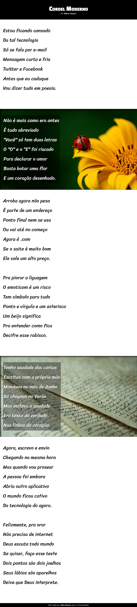

# Cordel Moderno

Projeto construído no cursoemvideo do professor
Gustavo Guanabara.

[Acesse aqui](https://silassmoura.github.io/projeto-cordel/) para acessar meu projeto.😎💻🖖🏻

## Tecnologias:
-HTML
-CSS
-GIT e Github

## Contato
silasaugusto23@gmail.com
@silassmoura